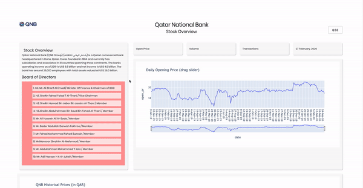

# QNB Dash App
Dashboards are the most used end products of an entire process of acquiring, cleaning, and analyzing data towards answering operational questions and managing an effective leadership. 
Plotly’s DASH is an open source visualization framework that combines the best of R Shiny, Tableau and powerBI, and packs them into an easily accessible and deployable framework. 

Deployment is straight forward and the documentation for dash and plotly graphing library is beautfiul. One of my favorite Python Library and R package so far. **Highly Recommended**

## What I enjoyed while working with Dash
  * You can beautify your dashboard using simple css and html codes. Just make sure you put the css file in an asset folder of the directory. Plotly automatically links to the asset folder for images, css and other attachments. 
  * Although I am always interested in the end result, I am also an aesthetics guy. So it was loads of fun building the layout of the dashboard first, and then embedded all the required figures and tables. 
  * Even though the plotly graphing libraries and plotly dash are seperate packages altogether, they work really well together and are very easy to integrate. All my graphs were built using the library first, and then I just embedded it into the layout of the app. 

*leave a comment or let me know if you want any other information*
